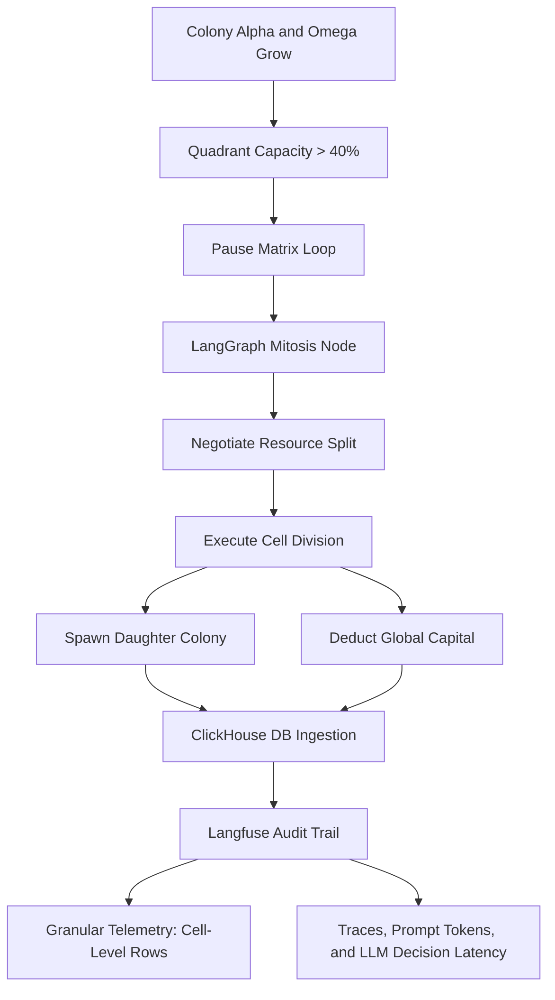

# 🧬 The Symbiosis Engine: Negotiating Cellular Growth at Matrix Scale
### 🎮 GitHub Repository Name: `game-of-agents`
### 🚀 A Split-Horizon Hybrid Framework for High-Throughput Biological Cellular Automata

---

## 📌 Executive Summary
**The Symbiosis Engine** is a hybrid neuro-symbolic simulation project designed to model resource coordination and sustainable cellular growth. 

Putting an LLM inside a fast physical loop causes execution to lag and crash. Relying purely on traditional video game math removes strategic flexibility. This project resolves that challenge using a **Split-Horizon Architecture**:
1. **High-Speed Execution Layer (Micro-Steps / Epochs)**: A custom 2D cellular automata engine (inspired by Conway’s Game of Life) handles fast, sub-second cell growth, resource depletion, and randomized disease decay.
2. **High-Level Coordination Layer (Macro-Steps)**: A stateful **LangGraph** orchestration workflow acts as an artificial chemical signaling network (Quorum Sensing). It pauses the grid to negotiate division (Mitosis) schedules and resource-sharing contracts when spatial capacity peaks.

To validate this high-throughput pipeline, **ClickHouse** acts as a high-speed telemetry black box recording individual cellular metabolism metrics, while **Langfuse** instruments and monitors the prompt logic, latency, and operational cost of the AI treaties.

---

## 🧬 Biological Core Concepts & Science Mapping

The project translates real-world microbiological pathways into deterministic software design choices:

REAL-WORLD MICROBIOLOGY   ==►    SIMULATION ENGINE ARCHITECTURE

Density-Dependent Inhibition           Quadrant Occupancy Threshold (40% Capacity)Inter-Species Quorum Sensing           LangGraph Stateful Negotiation NodesThe Stringent Response                 Growth Stagnation Phase (Empty Asset Pool)Mitosis/Binary Fission                 Cellular Array Cloning & Budget DeductionsMetabolic Cross-Feeding                Dynamic Age-Fraction Allocation Formula


### 1. Quorum Sensing & Chemical Signaling
In nature, cell colonies (like biofilms) track local population densities by secreting autoinducer molecules. When crowd thresholds are breached, genes switch to alter consumption or reproduction behaviors. In this project, **LangGraph** models this biochemical feedback loop as a stateful, symbolic coordinator.

### 2. Density-Dependent Inhibition & Mitosis
When cells fill up space, contact inhibition triggers a biological requirement: stop growing locally, or divide into new tissue space via Mitosis. Mitosis is incredibly expensive, requiring a surge of lipids and proteins. If tried during a nutrient deficit, it triggers a cellular **Stringent Response**, placing the population into a senescent, permanent **Growth Stagnation State**. 

### 3. Age-Based Fractional Allocation
Cellular nutrient absorption changes with cell maturity. This project implements a precise floating-point resource-draw rule tied to the individual cell's lifecycle percentage:
$$\text{Maturity Fraction } (P) = \frac{\text{Current Age}}{\text{Max Age}}$$
$$\text{Individual Resource Consumed} = 1.0 \times P$$

*   **Young/Incubating Cell ($10\%$ lifespan)**: Draws only $0.1$ units of its allocation slice.
*   **Fully Mature Cell ($100\%$ lifespan)**: Draws the full $1.0$ unit slice to fuel mitosis.

---

## 🏗️ System Architecture & Data Flow




### The ClickHouse Stress Test (Time-Warp Engine)
To demonstrate the capabilities of a columnar data store over row-based structures, the framework implements an adjustable `EPOCH_SPEED_MULTIPLIER`. 
* When accelerated (e.g., 50×), the engine processes 50 micro-epochs inside a single graphical screen frame loop.
* Because telemetry is logged at the **individual cell level** rather than aggregated by colony, a single visual frame generates thousands of floating-point records seamlessly. 

---

## 📂 Repository File Directory

```text
game-of-agents/
│
├── config/
│   └── docker-compose.yml       # Provisions local ClickHouse cluster instance
│
├── src/
│   ├── __init__.py
│   ├── models.py                # Pydantic data schemas for data type validation
│   ├── cells.py                 # Object-Oriented Cell definitions & metabolism functions
│   ├── engine.py                # Grid matrix computation & Temporal Time-Warp loops
│   ├── database.py              # ClickHouse batch injection streaming client
│   ├── agents.py                # LangGraph nodes and Langfuse tracer wrappers
│   └── main.py                  # Pygame graphical UI dashboard entry point
│
├── requirements.txt             # Project library package configurations
└── README.md                    # Core documentation landing page
```

---

## ⚙️ Data Engineering & Infrastructure Contracts

### 1. Pydantic Verification Structures (`src/models.py`)
```python
from pydantic import BaseModel, Field
from enum import Enum

class CellPhase(str, Enum):
    INCUBATING = "incubating"
    MATURE = "mature"
    DISEASED = "diseased"

class ColonyState(str, Enum):
    GROWING = "growing"
    NEED_MITOSIS = "need_mitosis"
    STAGNANT = "stagnant"

class CellLogSchema(BaseModel):
    timestamp_ns: int
    epoch: int
    cell_id: str
    colony_id: str
    current_age: int
    maturity_pct: float
    resource_consumed: float
    remaining_pool: float
```

### 2. High-Frequency ClickHouse Table Architecture (`config/`)
```sql
CREATE TABLE cellular_mitosis_telemetry (
    timestamp_ns Int64,
    epoch UInt32,
    cell_id String,
    colony_id String,
    current_age UInt16,
    maturity_pct Float32,
    resource_consumed Float64,
    remaining_pool Float64
) ENGINE = MergeTree()
ORDER BY (colony_id, epoch, timestamp_ns);
```

---

## 🖥️ Live Presentation Analytical Showcases

During live evaluation runs, the power of **Langfuse** and **ClickHouse** can be demonstrated by answering distinct systemic questions:

### A. The Langfuse UI Audit (Evaluating Strategic Decisions)
*   **Prompt/Contract Review**: Open the interface tree to show the raw JSON state input sent by LangGraph ($Colony A = 82\%$ vitality, $Colony B = 31\%$). Display the deterministic response schema enforcing the resource sharing treaty.
*   **Latency Cost Profile**: Highlight the millisecond freeze window required by the LLM layer compared to the fast physics loop.

### B. The ClickHouse Query Analytics (High-Throughput Telemetry)
Run these commands live in a terminal window to query thousands of rows written over accelerated epochs:

*   **Query 1: Dynamic Allocation Distribution Profile**
    ```sql
    SELECT colony_id, AVG(resource_consumed) AS avg_draw, MAX(current_age) AS longevity 
    FROM cellular_mitosis_telemetry 
    GROUP BY colony_id;
    ```
*   **Query 2: Identifying Growth Stagnation Bottlenecks**
    ```sql
    SELECT epoch, COUNT(*) AS cells_frozen_in_stagnation 
    FROM cellular_mitosis_telemetry 
    WHERE maturity_pct >= 100.0 AND remaining_pool < 250.0
    GROUP BY epoch ORDER BY epoch DESC LIMIT 5;
    ```